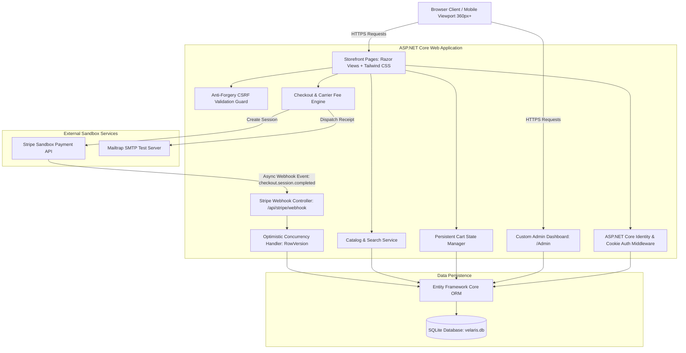

# System Architecture & Component Diagram — VELARIS

This document outlines the high-level component architecture of the VELARIS e-commerce application.

```mermaid
graph TD
    Client[Browser Client / Mobile Viewport 360px+]

    subgraph "ASP.NET Core Web Application"
        Storefront[Storefront Pages: Razor Views + Tailwind CSS]
        AdminPanel[Custom Admin Dashboard: /Admin]
        AuthModule[ASP.NET Core Identity & Cookie Auth Middleware]
        CSRFMiddleware[Anti-Forgery CSRF Validation Guard]
        CatalogController[Catalog & Search Service]
        CartController[Persistent Cart State Manager]
        CheckoutController[Checkout & Carrier Fee Engine]
        StripeWebhookHandler[Stripe Webhook Controller: /api/stripe/webhook]
        ConcurrencyService[Optimistic Concurrency Handler: RowVersion]
    end

    subgraph "Data Persistence"
        EFCore[Entity Framework Core ORM]
        SQLite[(SQLite Database: velaris.db)]
    end

    subgraph "External Sandbox Services"
        StripeCloud[Stripe Sandbox Payment API]
        MailtrapSMTP[Mailtrap SMTP Test Server]
    end

    Client -->|HTTPS Requests| Storefront
    Client -->|HTTPS Requests| AdminPanel
    Storefront --> AuthModule
    Storefront --> CSRFMiddleware
    Storefront --> CatalogController
    Storefront --> CartController
    Storefront --> CheckoutController

    CheckoutController -->|Create Session| StripeCloud
    StripeCloud -->|Async Webhook Event: checkout.session.completed| StripeWebhookHandler

    StripeWebhookHandler --> ConcurrencyService
    ConcurrencyService --> EFCore
    CatalogController --> EFCore
    CartController --> EFCore
    AdminPanel --> EFCore
    AuthModule --> EFCore

    EFCore --> SQLite
    CheckoutController -->|Dispatch Receipt| MailtrapSMTP
```
